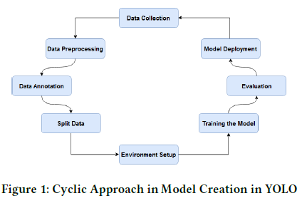
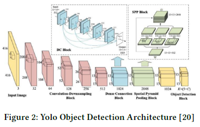
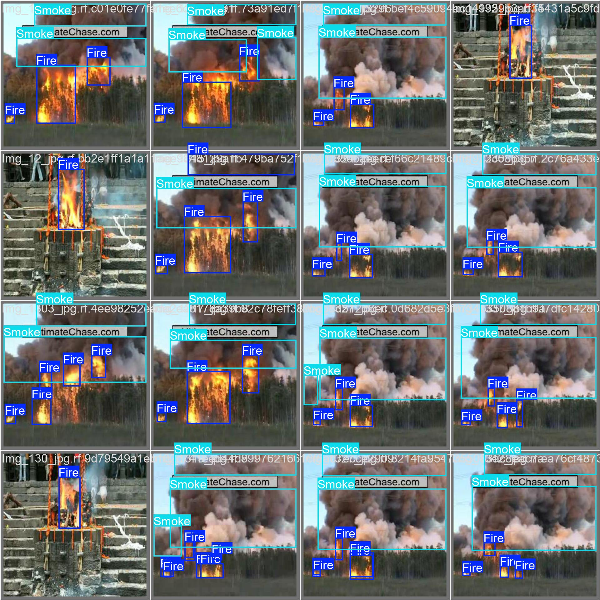
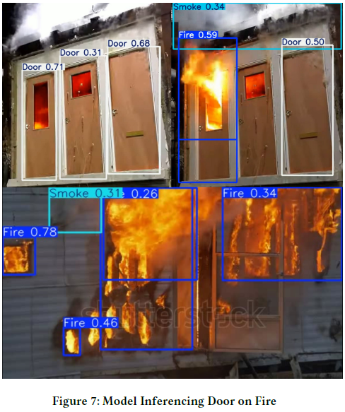

# Obstacle / Hazard Recognition in Indoor Environments During Evacuation

## Project Overview

This project investigates how computer vision, specifically the YOLO object detection algorithm, can be used to recognize obstacles and hazards (such as fire, smoke, furniture, or people) in indoor environments during emergency evacuations. By enabling real-time detection through a camera system, the approach aims to enhance building safety and inform evacuation decision-making more intelligently than traditional sensor-based systems.

This work is based on a study conducted at Malmö University by Awara Pirkhdrie, Department of Computer Science, Malmö University .

---

## Authors

- **Awara Pirkhdrie** – Department of Computer Science, Malmö University  
  [🔗 LinkedIn Profile](https://www.linkedin.com/in/awara-pirkhdrie/)
 
Date: 2025-01-09
## Abstract

Evacuation planning and real-time hazard recognition are critical for public safety in large buildings. Traditional methods such as static fire alarms or smoke sensors often fail to distinguish between partial and complete obstructions and cannot interpret visual cues. This project proposes a vision-based solution using deep learning, especially YOLOv8 and YOLOv11s models, to detect hazards like fire and smoke, as well as obstacles like tables and chairs that may block exit routes. 

Using labeled datasets, trained models, and real-world videos, this system measures not only the presence of hazards but also the size of obstacles, helping emergency systems decide whether an evacuation route is viable.

---


## Table of Contents

- [Project Overview](#project-overview)
- [Authors](#authors)
- [Abstract](#abstract)
- [Motivation](#motivation)
- [Research Questions](#research-questions)
- [Methodology](#methodology)
  - [Model Creation Process](#model-creation-process)
  - [Dataset Preparation](#dataset-preparation)
- [YOLOv8 Architecture](#yolov8-architecture)
- [Training and Evaluation](#training-and-evaluation)
- [Validation Results](#validation-results)
- [Door Obstruction by Fire and Smoke](#door-obstruction-by-fire-and-smoke)
  - [Technical Methodology](#technical-methodology)
  - [Practical Implementation](#practical-implementation)
  - [Limitations and Observations](#limitations-and-observations)
  - [Future Improvements](#future-improvements)
- [Results Summary](#results-summary)
- [Discussion](#discussion)
  - [Strengths and Contributions](#strengths-and-contributions)
  - [Limitations and Technical Challenges](#limitations-and-technical-challenges)
  - [Ethical and Practical Considerations](#ethical-and-practical-considerations)
  - [Lessons Learned](#lessons-learned)
- [Future Work](#future-work)
- [Citation](#citation)
- [References](#references)

---

## Motivation

- **Limitations of traditional systems**: Smoke sensors can trigger even if an exit is still usable, and cannot visually confirm obstructions.
- **Need for dynamic decision-making**: Emergency conditions change rapidly, so decisions about evacuation paths need to adapt in real time.
- **Smart buildings and IoT**: Integrating visual intelligence aligns with next-generation smart infrastructure.

---

## Research Questions

1. **RQ1**: How accurately can a computer vision system identify irregular hazards (like fire and smoke) that impede evacuation routes?
2. **RQ2**: How effectively can a system detect and classify physical obstructions (e.g., furniture, people) that block exits?

---

## Methodology

A cyclic and iterative development process was adopted, in line with Design Science methodology. This allows continuous refinement of models based on evaluation feedback.

### Model Creation Process



---

### Dataset Preparation

- **Fire and Smoke**: Collected from Roboflow, Kaggle, and real-world images (4,299 images)
- **Doors**: Captured from Malmö University's Niagara Building and Google Open Images (3,560 images)
- **Tables, Chairs, Persons**: Custom photos + open data (489 each)

All images were labeled using Roboflow. Augmentation techniques (rotation, grayscale, noise) were applied to enhance dataset diversity.

---

## YOLOv8 Architecture

We trained models using YOLOv8 and YOLOv11s for their speed and efficiency in real-time applications. The model learns to detect objects by identifying bounding boxes and class labels across input images.



---

## Training and Evaluation

- **Hardware**: Intel Core i9-9880H @ 2.30GHz, 62 GB RAM
- **Epochs**: 50
- **Validation Split**: 20%
- **Loss Metrics Tracked**: Box Loss, Class Loss, DFL Loss
- **Model Sizes**: Used YOLO small models for deployment feasibility on IoT/Edge devices

---

## Validation Results

The model was tested using unseen video and image data, especially focusing on fire, smoke, and door detection. Results showed high accuracy for doors (0.98), strong for fire (0.84), and moderate for smoke (0.68).



---

## Door Obstruction by Fire and Smoke

In scenarios where fire or smoke partially covers an exit, the model intelligently infers whether the door is still visible and usable. If flames overlap saved bounding boxes of previously “safe” door views, the system can trigger alarms.

This technique simulates real-world conditions where visual inspection would be necessary.



---

### Future Improvements

- Incorporating dual cameras or stereo vision for depth accuracy.
- Using infrared markers or ArUco tags for automated scale calibration.
- Real-time adjustment of the focal index using metadata from camera hardware.

---


## Results Summary

The experimental evaluation focused on two major prototype models developed using the YOLO architecture—one for detecting hazardous conditions such as fire and smoke, and another for identifying physical obstructions like furniture or people in front of exits. Each model was trained, tested, and validated on curated datasets representing real-world evacuation scenarios.

| **Task**                            | **Performance**                  |
|-------------------------------------|----------------------------------|
| Door Detection                      | High accuracy (≈ 98%)         |
| Fire Detection                      | Strong performance (≈ 84%)    |
| Smoke Detection                     | Moderate performance (≈ 68%)  |
### Hazard Recognition
- **Doors engulfed in fire or smoke** were successfully identified with lower confidence scores, and in extreme cases, were correctly no longer classified as usable exits.
- **Smoke detection** accuracy varied depending on image quality, lighting, and transparency of the smoke. Improvement is expected with dataset balancing.

### Evaluation Insight
- Models showed strong generalization when tested on previously unseen videos.
- Bounding box overlap logic was tested for determining if exits were obstructed by flames or furniture, simulating real-world emergency triage logic.

### Limitations Observed
- **Smoke detection** was limited by fewer samples in the validation set, suggesting the need for dataset expansion.
- Visual-only models cannot estimate object weight (to assess movability), requiring future sensor integration.

These results demonstrate the potential of vision-based systems for supporting dynamic evacuation decisions in real-time, with significant advantages over static sensors or pre-programmed routes.


---

## Discussion

This study highlights the potential of computer vision—particularly YOLO-based object detection models—for improving safety during emergency evacuations.

### Strengths and Contributions

- **Real-time response**: The models performed inference in less than 0.3 seconds per frame, which is critical during fast-moving emergencies where seconds matter.
- **Two complementary models**: One model focuses on hazardous anomalies (fire, smoke), while the other handles physical obstructions (tables, chairs, people). This two-model system mimics the logic of a human responder assessing both immediate danger and passability of escape routes.
- **Visual reasoning with geometry**: By using the pinhole camera model, the system can estimate object sizes using only one camera, eliminating the need for depth sensors or LiDAR in early prototypes.
- **Bounding box overlap logic**: We introduced a practical decision-making strategy that compares saved door bounding boxes (under normal conditions) with live detections to infer whether exits are blocked.

### Limitations and Technical Challenges

- **Smoke detection challenges**: Smoke, unlike fire, is semi-transparent, highly variable, and influenced by lighting conditions. The model struggled to detect it reliably, especially in cases with thin or distant smoke. This issue was compounded by a smaller number of smoke images in the validation set.
- **Inability to measure weight**: The system cannot determine whether a detected object is movable or not—an important consideration for evacuation. For example, a plastic chair may be easily pushed aside, while a heavy cabinet is not. This limitation could be addressed in future work by integrating physical sensors or learning from human movement around the object.
- **Static annotations vs. dynamic environments**: While using saved "safe door" annotations is useful, it assumes consistent environmental layout. In dynamic or damaged environments (e.g., earthquakes), exit locations may shift or become physically inaccessible regardless of detected hazards.

### Ethical and Practical Considerations

- **False positives/negatives** during hazard detection can have severe consequences. A false "clear path" detection might endanger evacuees, while a false "blocked" warning could create unnecessary panic or inefficiency.
- **Human-centric design** is essential. Systems should not just detect hazards, but also consider human behavior—e.g., crowd density, people falling, or individuals with mobility limitations. This points toward integration with behavior datasets (such as HBDset) and multi-sensor input.

### Lessons Learned

- Building real-time safety-critical systems requires balancing accuracy, speed, interpretability, and system complexity.
- Collaboration between software engineers, fire safety experts, and building designers is necessary to define appropriate alarm thresholds, exit path logic, and acceptable risk margins.
- Even a partially functioning visual system can improve current static evacuation protocols if deployed as an advisory layer alongside traditional alarms.

Overall, this project offers a flexible and extensible framework that lays the foundation for smarter emergency response systems. While not production-ready, the prototype demonstrates the feasibility of using computer vision to reason about exit usability, detect dynamic hazards, and adapt evacuation logic accordingly.


---

## Future Work

- Integrate gas/toxic fume sensors to detect invisible hazards
- Use stereo or depth cameras for more accurate 3D mapping
- Implement anomaly detection to compare live vs. baseline video feeds

---

## Citation

```text
Pirkhdrie, A. (2025). Obstacle / Hazard Recognition in Indoor Environments During Evacuation. Malmö University.

https://www.linkedin.com/posts/awara-pirkhdrie_trained-a-yolo-based-ai-model-for-50-epochs-activity-7266927529398026240-3nfk?utm_source=social_share_video_v2&utm_medium=android_app&rcm=ACoAADhWKPUBqaQPwBdijRsPWw2O4fGsVoO2juI&utm_campaign=copy_link


Thank you Hamed Talibi, for your time and insightful contributions to the project. It has been a pleasure working with you
```


## References

1. Redmon, J., Divvala, S., Girshick, R., & Farhadi, A. (2016). *You Only Look Once: Unified, Real-Time Object Detection*. In CVPR. [DOI: 10.1109/CVPR.2016.91](https://doi.org/10.1109/CVPR.2016.91)

2. Hevner, A. R. (2007). *A three cycle view of design science research*. Scandinavian Journal of Information Systems, 19(2), 4.

3. Xiong, Q., Zhu, Q., Du, Z., et al. (2017). *A Dynamic Indoor Field Model for Emergency Evacuation Simulation*. ISPRS Int. J. Geo-Inf., 6(4), 104.

4. Karampotsis, E., Kioskli, K., Tsirimpa, A., et al. (2024). *Understanding evacuation behavior for effective disaster preparedness: a hybrid machine learning approach*. Natural Hazards, 1–39.

5. Khare, O., Gandhi, S., Rahalkar, A., & Mane, S. (2023). *YOLOv8-Based Visual Detection of Road Hazards: Potholes, Sewer Covers, and Manholes*. In IEEE PuneCon, 1–6.

6. Yoo, S. J., & Choi, S. H. (2022). *Indoor AR navigation and emergency evacuation system based on ML and IoT*. IEEE IoT Journal, 9(21), 20853–20868.

7. Alqahtani, A., Alsubai, S., & Bhatia, M. (2024). *Applied AI framework for smart evacuation in industrial disasters*. Applied Intelligence, 1–16.

8. Pérez-García, F., Sparks, R., & Ourselin, S. (2021). *TorchIO: efficient preprocessing of medical images*. Comput. Methods Programs Biomed., 208, 106236.

9. Liang, J., & Cheng, J. (2024). *Mirror Target YOLO: Indirect Vision for Fire Detection in Heritage Buildings*. arXiv:2411.13997.

10. Vu, V., Tran-Anh, D., & Tran, C. (2024). *Forest Fire Smoke Detection Using Video-Based Multiple Object Kinetic Emission Detection*. SSRN. [URL](https://ssrn.com/abstract=5005161)

11. Qian, J., Hong, C., Zhang, K., et al. (2024). *High Quality Fire Smoke Dataset: A Benchmark for Fire and Smoke Detection*. ACM. [DOI: 10.1145/3688867.3690170](https://doi.org/10.1145/3688867.3690170)

12. Yang, M., Qian, S., & Wu, X. (2024). *Real-time fire and smoke detection with transfer learning*. IET Image Processing, 18, 3716–3728. [DOI: 10.1049/ipr2.13187](https://doi.org/10.1049/ipr2.13187)

13. Lee, H. G., Pham, T. N., Nguyen, V. H., et al. (2024). *Fire Cause Classification Using CNN-Based Models*. IEEE Access, 12, 135104–135113. [DOI: 10.1109/ACCESS.2024.3461319](https://doi.org/10.1109/ACCESS.2024.3461319)

14. Deng, H., Ou, Z., Zhang, G., et al. (2021). *BIM and Computer Vision-based Fire Evacuation Framework*. Sensors, 21(11), 3851.

15. Ding, Y., Chen, X., Wang, Z., et al. (2024). *Human Behaviour Detection Dataset (HBDset) for Evacuation Safety*. Journal of Safety Science and Resilience, 5, 355–364. [DOI: 10.1016/j.jnlssr.2024.04.002](https://doi.org/10.1016/j.jnlssr.2024.04.002)

16. Jiang, X., Zhang, P., Yu, A., et al. (2024). *Emergency Evacuation via Long-Range Communication*. Journal of Industrial Info. Integration, 39, 100601. [DOI: 10.1016/j.jii.2024.100601](https://doi.org/10.1016/j.jii.2024.100601)

17. Yen, H. H., & Lin, C. H. (2024). *IoT-Enabled Multi-Floor Evacuation Signage*. Sensors, 24, 1115. [DOI: 10.3390/s24041115](https://doi.org/10.3390/s24041115)

18. Le, T. V., Tran, H. T., & Bouzefrane, S. (2024). *Trusted Fog-Based Evacuation System*. Journal of Information and Telecommunication, 8(4), 417–451. [DOI: 10.1080/24751839.2024.2306787](https://doi.org/10.1080/24751839.2024.2306787)

19. Terven, J., Córdova-Esparza, D. M., & Romero-González, J. A. (2023). *A Review of YOLO Architectures: From v1 to YOLO-NAS*. Machine Learning & Knowledge Extraction, 5(4), 1680–1716.

20. Egashira, T., Nishikawa, H., Kong, X., & Tomiyama, H. (2021). *Raspberry Pi Security Camera with Container-based Allocation*. ICEIC.

21. Xu, S. S., & Shue, S. (2024). *YOLO Object Detection Performance on Edge Devices*. ISNCC. [DOI: 10.1109/ISNCC62547.2024.10759057](https://doi.org/10.1109/ISNCC62547.2024.10759057)


